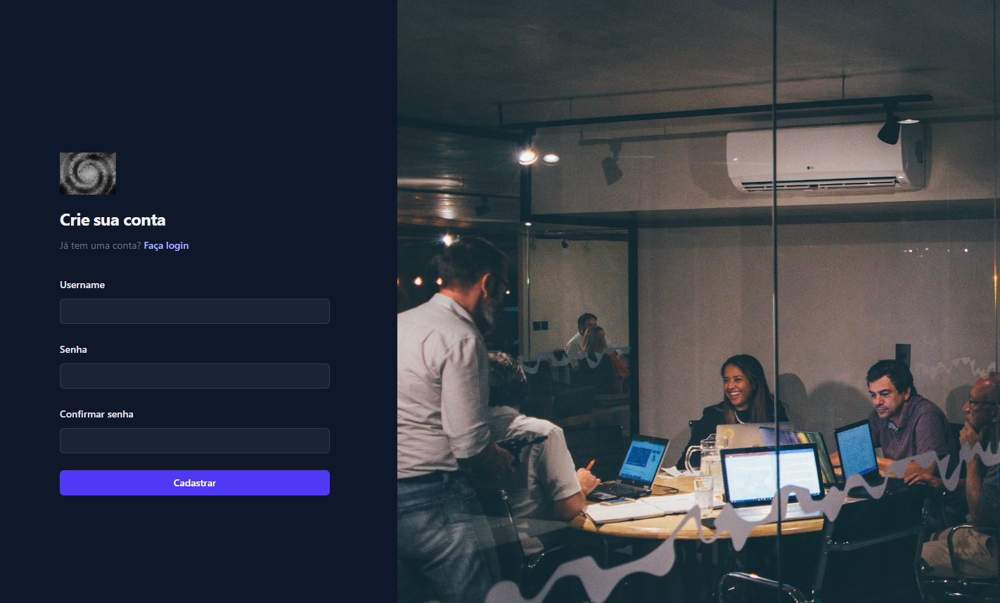
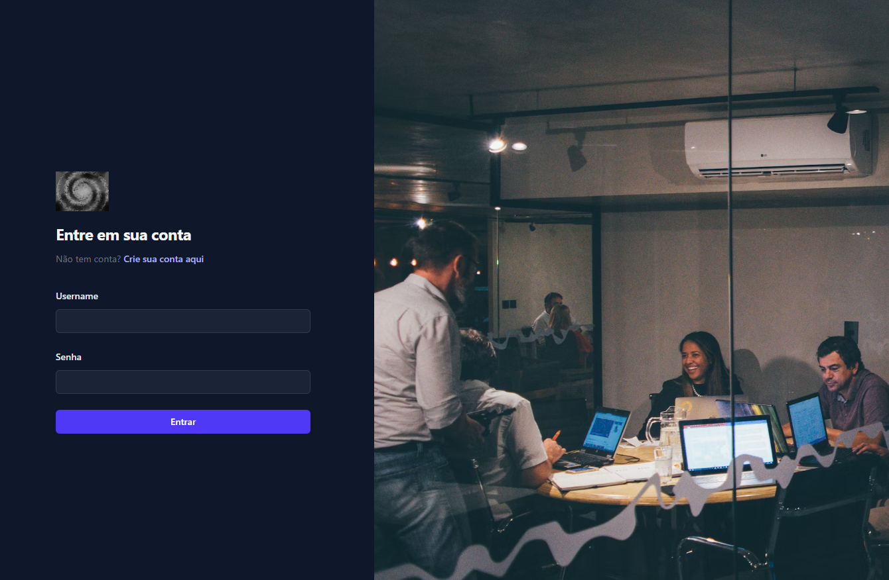
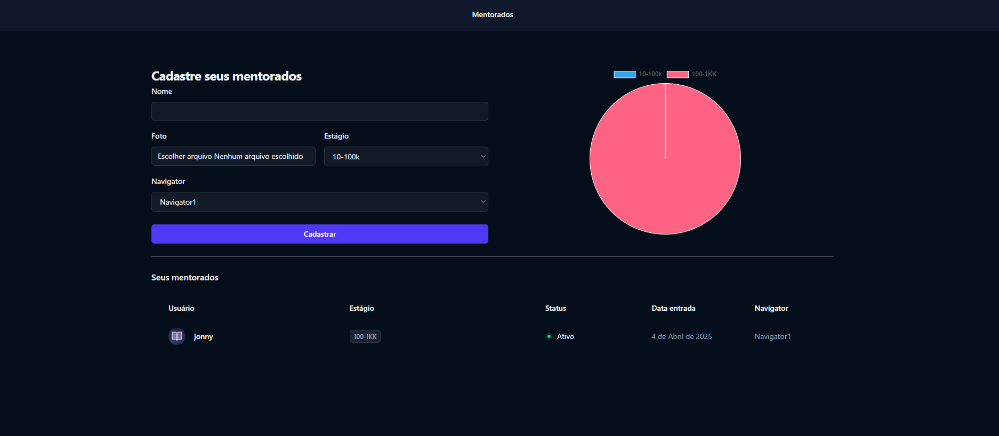
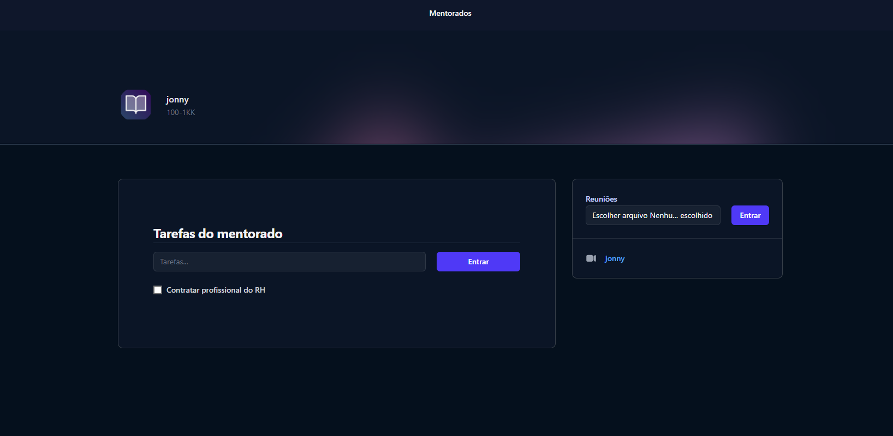
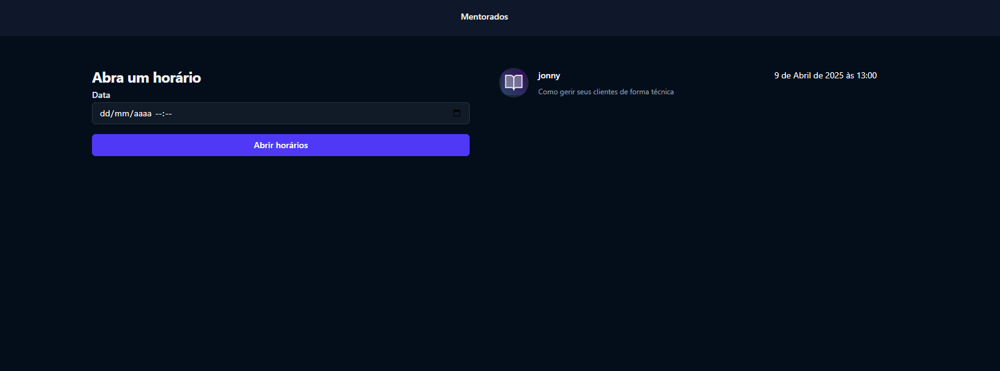
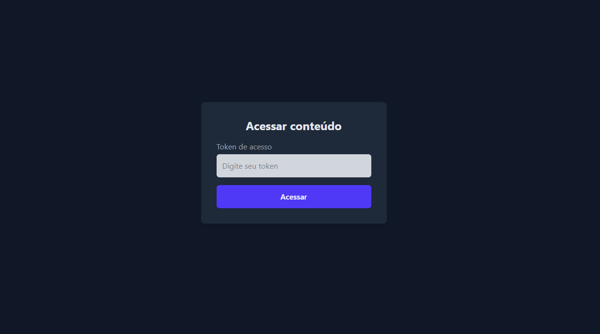
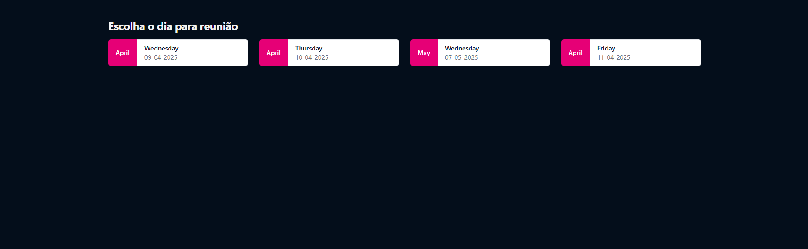
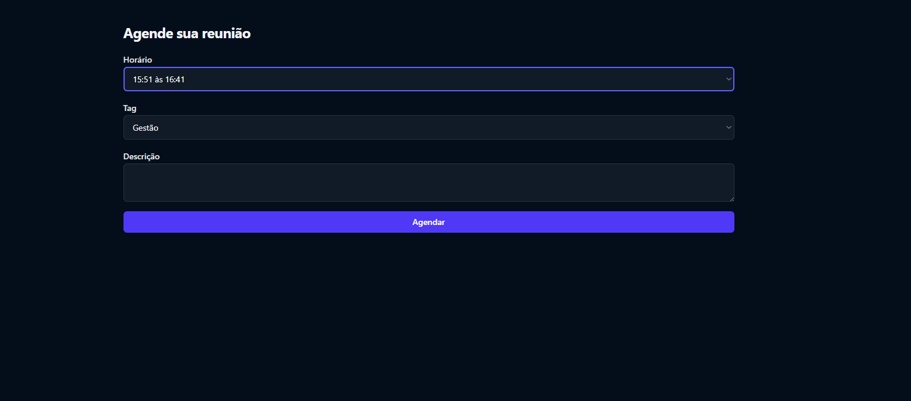
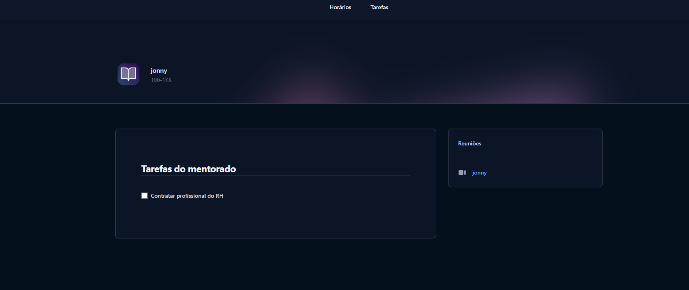

> 💡 Sistema web para coachs/mentores gerenciarem alunos com tarefas, vídeos e agendamento de reuniões.  

---

## 🧭 Funcionalidades Principais

### 👤 *Área do Coach*
- 🔐 Login e cadastro de coachs
  
  📸 *Tela de cadastro* 
  

  
  

  📸 *Tela de login* 
  

  
  

- 📋 Listagem de alunos
- 📊 Gráfico de pizza com informações dos mentorados

  📸 *Tela de administração* 
  

  
  

  
- 📂 Tela de gerenciamento de cada aluno:
  - ✅ Cadastro de tarefas
  - 🎥 Upload de vídeos
  - ✔️ Marcar tarefas como concluídas
    
    📸 *Gerenciamento do aluno* 
  

  
  

- 🔑 Geração de token único para cada aluno
- 🔗 Criação de agenda de datas e horários disponíveis para reuniões

  📸 *Disponibilizar horários* 
  

  
  

---

### 🎓 *Área do Aluno*
- 🔐 Acesso via link + token disponibilizado pelo coach

  📸 *login do aluno* 
  

  
  

  
- 📅 Escolha de dia para marcar reunião

  📸 *Dia da reunião* 
  

  
  

- 🕒 Seleção de horários disponíveis

  📸 *Agendar reunião* 
  

  
  

- 📑 Tela com todas as tarefas atribuídas
  - ✅ Checkbox para marcar como concluída
  - 🎞️ Visualização dos vídeos enviados pelo coach

📸 *Área do aluno* 
  

  
  

---

### 🚀 Como rodar o projeto localmente

Siga os passos abaixo para clonar e executar este projeto na sua máquina:

---

### 📁 1. Clone o repositório

bash
git clone https://github.com/seu-usuario/seu-repositorio.git
cd seu-repositorio

---

### 🧪 2. Crie e ative um ambiente virtual

bash
python -m venv venv
# No Windows:
venv\Scripts\activate
# No Linux/macOS:
source venv/bin/activate

---

### 📆 3. Instale as dependências

bash
pip install -r requirements.txt

---

### 🔐 4. Configure as variáveis de ambiente

Crie um arquivo .env na raiz do projeto com o seguinte conteúdo (baseado no .env.example):

env
SECRET_KEY=sua-chave-secreta-aqui
DEBUG=True

> Dica: Gere uma nova SECRET_KEY executando:

bash
python -c "from django.core.management.utils import get_random_secret_key; print(get_random_secret_key())"

---

### 🚠 5. Aplique as migrações do banco de dados

bash
python manage.py migrate

---

### 👤 6. (Opcional) Crie um superusuário

bash
python manage.py createsuperuser

---

### ▶️ 7. Execute o servidor de desenvolvimento

bash
python manage.py runserver

Acesse o projeto em: [http://127.0.0.1:8000](http://127.0.0.1:8000)

---
